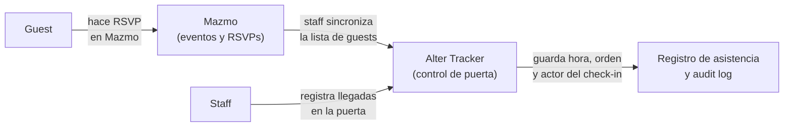

# Mazmo

[Mazmo](https://mazmo.net) es una red social orientada a la comunidad LGBTQ+ de America Latina. Ofrece espacios de comunidad, mensajeria, y un sistema de eventos donde las organizaciones publican sus actividades y los miembros confirman asistencia (RSVP).

Alter usa Mazmo como canal principal para publicar sus meetups. Cuando Club Vanta anuncia un evento, lo hace a traves de un "evento" en Mazmo. Las personas que quieren asistir confirman su presencia directamente ahi.

## Por que existe el Alter Tracker

Mazmo gestiona bien los RSVPs, pero no tiene herramientas para operar la puerta de un evento. Cuando el evento esta en curso, el staff necesita saber quien ya llego, en que orden, y si hay personas que no deben ingresar. Mazmo no ofrece nada de eso.

El Alter Tracker existe para cubrir ese gap: toma la lista de RSVPs de Mazmo y agrega la capa de gestion en tiempo real -- registro de llegadas, orden de entrada, lista de bans por org, y un audit log completo.

## La relacion entre Mazmo y el Tracker

El Alter Tracker no crea ni modifica nada en Mazmo. El flujo de datos es en una sola direccion: de Mazmo hacia el tracker.

Cada meetup en el tracker esta vinculado a una URL de evento en Mazmo. Cuando el staff sincroniza el meetup, el sistema consulta esa URL en Mazmo y descarga la lista de RSVPs actual. A partir de ahi, el tracker opera de forma independiente -- los check-ins, bans y el audit log son internos.

## Lo que el Tracker obtiene de Mazmo

Hay dos momentos en los que el tracker consulta a Mazmo:

**Al crear un meetup:** el tracker consulta la URL del evento para obtener el nombre y la fecha del evento. Esos datos se guardan localmente. Si el nombre o la fecha cambian en Mazmo despues de la creacion, el tracker no se actualiza automaticamente.

**Al sincronizar:** el tracker descarga la lista completa de RSVPs actuales. Ver [Sync desde Mazmo](sync.md) para el detalle del proceso.

## Identidad de los guests

La identidad de los guests (su `mazmo_user_id`, `username` y `displayname`) tambien viene de Mazmo. El `mazmo_user_id` es el identificador que Mazmo le asigna a cada cuenta y nunca cambia. Es lo que el tracker usa como clave primaria para reconocer a la misma persona en distintos eventos y syncs. Ver [Guests](guests.md).
