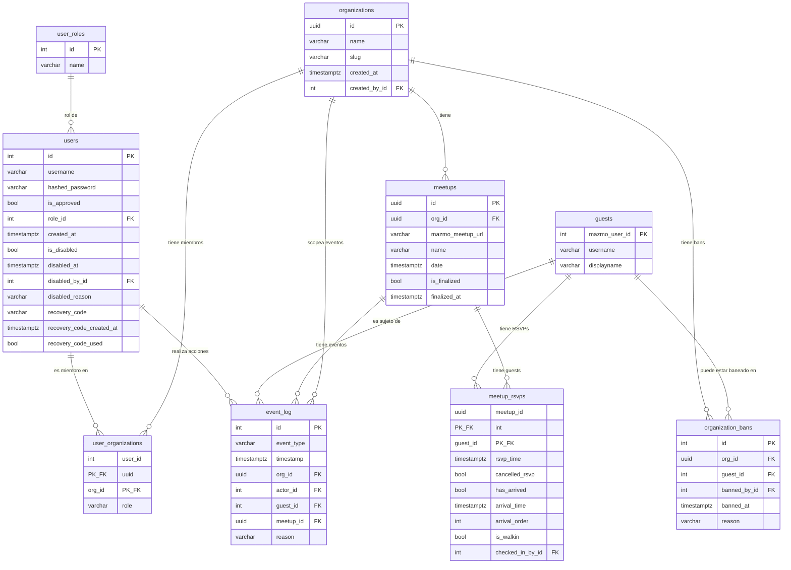

# Esquema de base de datos

Esquema actual post-migraciones de organizaciones (0001-0014). Todas las tablas usan PostgreSQL.

## Diagrama de relaciones

---

## Tablas

### `user_roles`

Tabla de lookup para roles globales. Sembrada por migraciones; no editable por usuarios.

| Columna | Tipo | Constraints | Notas |
|---------|------|-------------|-------|
| id | integer | PK | Auto-increment |
| name | varchar(32) | UNIQUE, NOT NULL | USER o SITE_ADMIN |

---

### `users`

Cuentas de staff y admin. Las cuentas nunca se borran fisicamente; ver `is_disabled`.

| Columna | Tipo | Constraints | Notas |
|---------|------|-------------|-------|
| id | integer | PK | Auto-increment |
| username | varchar(64) | UNIQUE, NOT NULL, indexed | Case-sensitive |
| hashed_password | varchar | NOT NULL | Hash Argon2 |
| is_approved | boolean | NOT NULL, default false | Debe ser true para poder entrar |
| role_id | integer | FK -> user_roles.id, NOT NULL | Rol global |
| created_at | timestamptz | NOT NULL | |
| is_disabled | boolean | NOT NULL, default false | Soft-delete |
| disabled_at | timestamptz | nullable | |
| disabled_by_id | integer | FK -> users.id, nullable | Quien la deshabilito |
| disabled_reason | varchar(500) | nullable | |
| recovery_code | varchar(6) | nullable | String de 6 digitos; NULL cuando no hay codigo activo |
| recovery_code_created_at | timestamptz | nullable | Para calcular el TTL de 72 horas |
| recovery_code_used | boolean | NOT NULL, default false | Marcado como usado al completar un reset exitoso |

---

### `organizations`

Contenedores de nivel superior. Cada org posee sus propios meetups, bans y eventos del audit log.

| Columna | Tipo | Constraints | Notas |
|---------|------|-------------|-------|
| id | uuid | PK | Generado al crear |
| name | varchar(128) | UNIQUE, NOT NULL | Nombre de display |
| slug | varchar(64) | UNIQUE, NOT NULL | Identificador para URLs |
| created_at | timestamptz | NOT NULL | |
| created_by_id | integer | FK -> users.id, nullable | |

---

### `user_organizations`

Membresia de un usuario en una organizacion con un rol especifico. PK compuesta en (user_id, org_id).

| Columna | Tipo | Constraints | Notas |
|---------|------|-------------|-------|
| user_id | integer | PK + FK -> users.id | |
| org_id | uuid | PK + FK -> organizations.id | |
| role | varchar(32) | NOT NULL | OrgRole: STAFF o ADMIN |

Un usuario puede ser miembro de multiples orgs con roles distintos en cada una.

---

### `guests`

Identidades obtenidas desde Mazmo. Los guests son globales -- no pertenecen a ninguna org especifica. La PK es el propio ID de Mazmo, lo que garantiza upserts idempotentes.

| Columna | Tipo | Constraints | Notas |
|---------|------|-------------|-------|
| mazmo_user_id | integer | PK | Asignado por Mazmo; nunca cambia |
| username | varchar | NOT NULL, indexed | Handle de Mazmo |
| displayname | varchar | NOT NULL | Cambia frecuentemente |

Los bans se almacenan en `organization_bans`, no en esta tabla. No existe campo `is_banned` en guests.

---

### `meetups`

Eventos trackeados por el sistema. Cada meetup pertenece a una org y esta vinculado a una URL de Mazmo.

| Columna | Tipo | Constraints | Notas |
|---------|------|-------------|-------|
| id | uuid | PK | Generado al crear |
| org_id | uuid | FK -> organizations.id, NOT NULL, indexed | |
| mazmo_meetup_url | varchar | UNIQUE, NOT NULL | URL completa del evento en Mazmo |
| name | varchar | NOT NULL, indexed | Obtenido de Mazmo al crear |
| date | timestamptz | NOT NULL | Obtenido de Mazmo al crear |
| is_finalized | boolean | NOT NULL, default false | Bloquea check-ins y syncs cuando es true |
| finalized_at | timestamptz | nullable | Seteado al finalizar |

---

### `meetup_rsvps`

Asociacion entre un guest y un meetup, con datos de RSVP y check-in. PK compuesta en (meetup_id, guest_id).

| Columna | Tipo | Constraints | Notas |
|---------|------|-------------|-------|
| meetup_id | uuid | PK + FK -> meetups.id | |
| guest_id | integer | PK + FK -> guests.mazmo_user_id | |
| rsvp_time | timestamptz | NOT NULL | Cuando se registro el RSVP en Mazmo |
| cancelled_rsvp | boolean | NOT NULL, default false | |
| has_arrived | boolean | NOT NULL, default false, indexed | Solo modificado por el flujo de check-in; el sync nunca lo toca |
| arrival_time | timestamptz | nullable | Solo seteado por check-in |
| arrival_order | integer | nullable | Asignado por trigger de DB; no por codigo de aplicacion |
| is_walkin | boolean | NOT NULL, default false | True si fue agregado como walk-in |
| checked_in_by_id | integer | FK -> users.id, nullable | Que staff hizo el check-in |

!!! warning "Campos intocables por el sync"
    `has_arrived`, `arrival_time`, `arrival_order`, y `checked_in_by_id` solo son modificados por el flujo de check-in. El sync nunca los toca, aunque actualice otros campos del RSVP.

`arrival_order` es asignado por un **trigger de base de datos** en el momento del check-in -- no es calculado por el codigo de aplicacion. El trigger asigna el siguiente entero disponible dentro del meetup.

---

### `organization_bans`

Bans activos de guests dentro de una organizacion. Una fila = un ban activo. Al desbanear se elimina la fila; el historial queda en `event_log`.

| Columna | Tipo | Constraints | Notas |
|---------|------|-------------|-------|
| id | integer | PK | Auto-increment |
| org_id | uuid | FK -> organizations.id, NOT NULL, indexed | |
| guest_id | integer | FK -> guests.mazmo_user_id, NOT NULL, indexed | |
| banned_by_id | integer | FK -> users.id, nullable | |
| banned_at | timestamptz | NOT NULL | |
| reason | varchar(500) | NOT NULL | Obligatorio; no puede estar vacio |

**Constraint UNIQUE en (org_id, guest_id):** solo puede existir un ban activo por guest por org.

---

### `event_log`

Audit log. Una fila por accion auditable. Las filas nunca se modifican ni eliminan.

| Columna | Tipo | Constraints | Notas |
|---------|------|-------------|-------|
| id | integer | PK | Auto-increment |
| event_type | varchar(32) | NOT NULL, indexed | Ver valores de EventType abajo |
| timestamp | timestamptz | NOT NULL, indexed | Default: now() |
| org_id | uuid | FK -> organizations.id, nullable, indexed | NULL solo para GUEST_CREATED |
| actor_id | integer | FK -> users.id, nullable | El staff que realizo la accion |
| guest_id | integer | FK -> guests.mazmo_user_id, nullable, indexed | |
| meetup_id | uuid | FK -> meetups.id, nullable, indexed | |
| reason | varchar(500) | nullable | Presente para UNDO_CHECK_IN y BAN |

**Valores de EventType:** `CHECK_IN`, `UNDO_CHECK_IN`, `BAN`, `UNBAN`, `MEETUP_FINALIZED`, `MEETUP_UNFINALIZED`, `WALKIN`, `GUEST_CREATED`

Cada entrada del audit log se escribe en la misma transaccion de base de datos que la accion que registra. Si la accion se revierte, la entrada del log se revierte con ella.

---

## Historial de migraciones

| Migracion | Resumen |
|-----------|---------|
| 0001 | Schema inicial: user_roles, users, guests, meetups, meetup_rsvps |
| 0002 | Refactor de schema multi-meetup |
| 0003 | Campos de disable en users; campos de tracking de check-in en meetup_rsvps |
| 0004 | Campos de ban global en guests (removidos en 0013) |
| 0005 | Tabla event_log |
| 0006 | Campos de finalizacion en meetups |
| 0007 | Flag is_walkin en meetup_rsvps |
| 0008 | Tabla organizations |
| 0009 | Tabla user_organizations |
| 0010 | FK meetups.org_id; seed org "Club Vanta"; backfill de membresias de usuarios |
| 0011 | Tabla organization_bans; org_id en event_log; backfill |
| 0012 | Renombrar roles globales (STAFF -> USER, ADMIN -> SITE_ADMIN); migrar usuarios |
| 0013 | Remover campos de ban global de guests; migrar bans existentes a organization_bans |
| 0014 | Campos de recovery_code en users |
